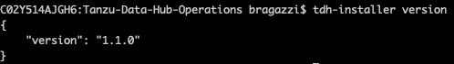
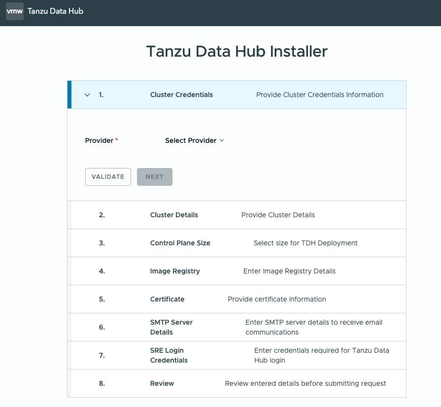
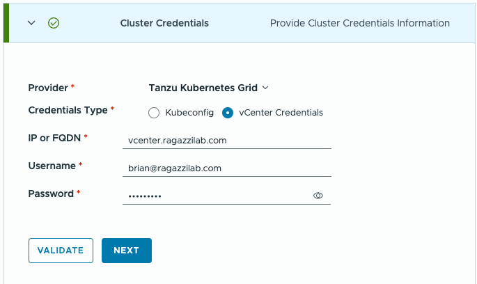
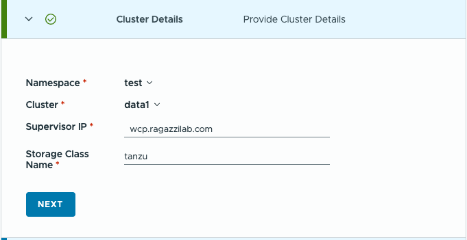
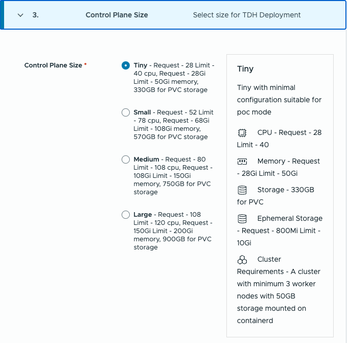
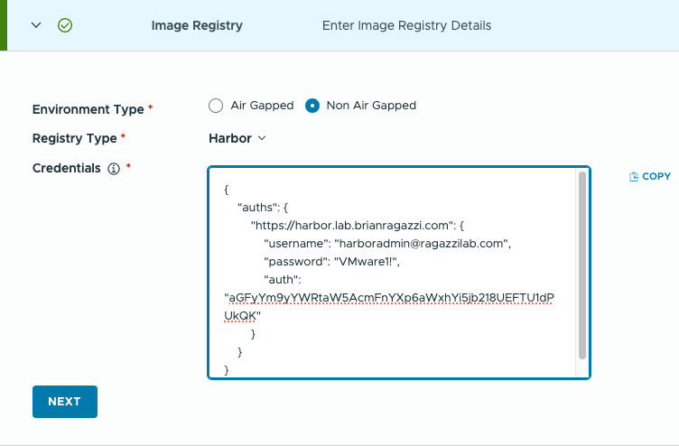
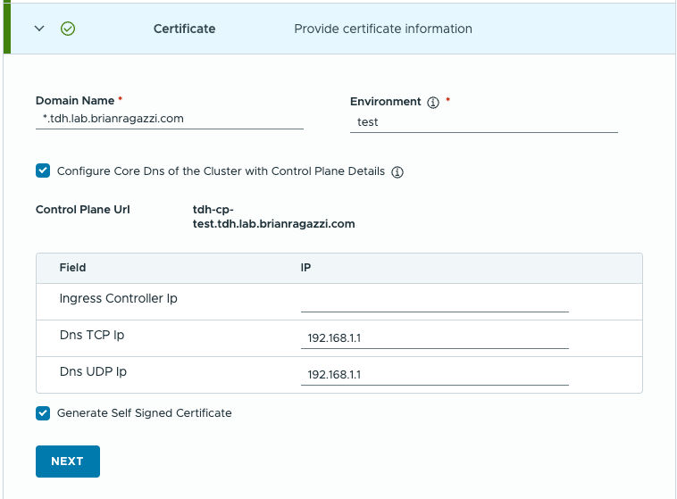
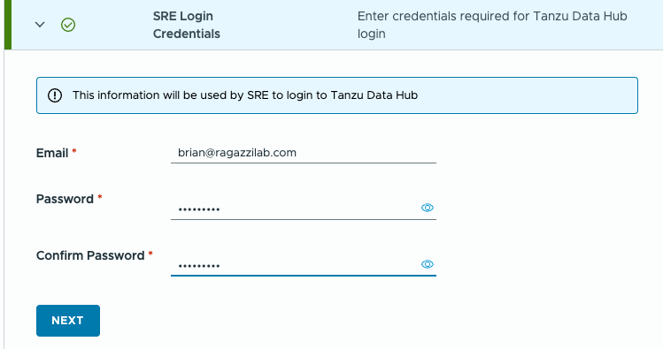
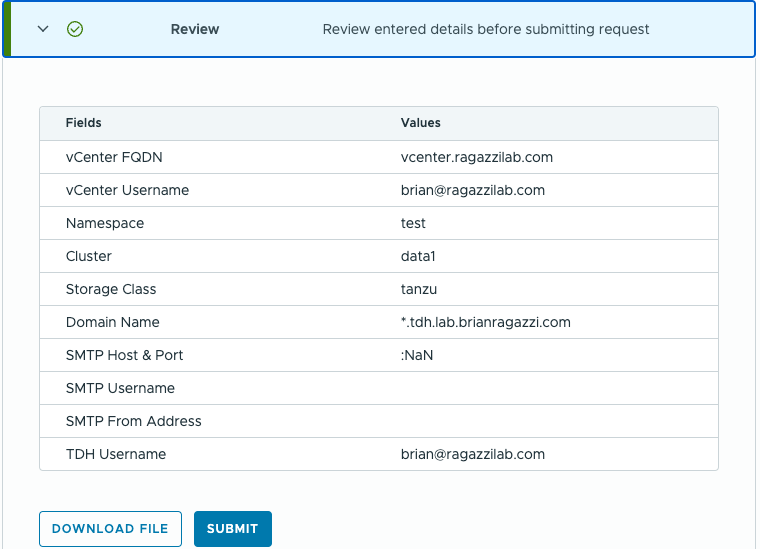
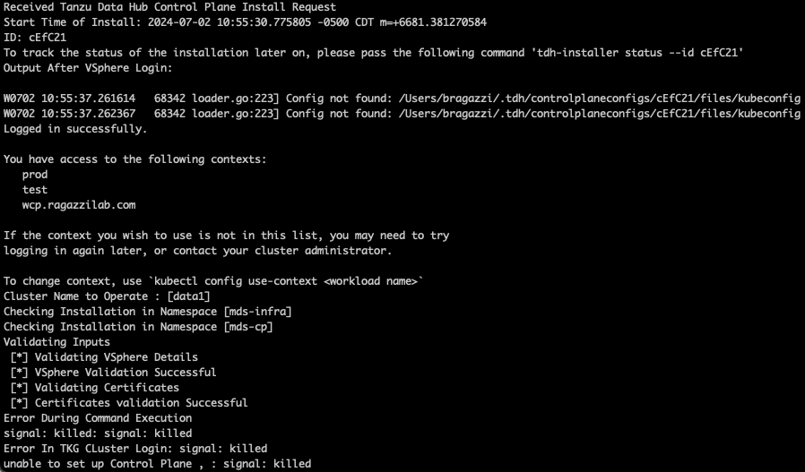

# Tanzu-Data-Hub-Operations
Installing, configuring and working with TDH


# Installing on TKGS
## Pre-reqs - as on 7/2/24
* Kubernetes - suggests TKR v1.26.5
  * **make sure the cluster can provide ~40 CPU and ~50+GB RAM**
  * 50GB+ available in /etc/containerd per worker node
  * example v1beta1 cluster [here](./data1.yaml)
* Image Registry
* Storage Class supporting at least RWO
* workstation with access to target cluster (Windows, Mac, Linux)

## The Bits
* Download the TDH Installer CLI
* in terminal, navigate to the folder where the tdh-darwin-amd64 file is
* run ```sudo install tdh-darwin-amd64 /usr/local/bin/tdh-installer```
* check version ```tdh-installer version```
* NOTE - mac will complain about it being downloaded from the internet, you'll have to allow it to run under Settings|Privacy & Security



## Installer
1. Run ```tdh-installer install --ui``` to start installer in UI mode



2. We'll be installing on an existing TKGS cluster, so under Cluster Credentials, select **Tanzu Kubernetes Grid** as the Provider and for ease of install, select and provide the vCenter Credentials, then click **Validate** & **Next**:



3. Under Cluster Details, select the vSphere Namespace where the target cluster resides, then select the cluster.  Provide the FQDN of the Supervisor ClusterAPI and the storage class name to use.  (Not sure why this isn't detectable and the default SC isn't used)



4. Under **Control Plane Size**, notice how huge even *Tiny* is.  Select the appropriate size - I'm going with **Tiny**



5. Under **Image Registry**, Select *Non Air Gapped* and *Google Artifact Registry*


Paste this into the text box
```
{
      "auths": {
        "https://us-docker.pkg.dev": {
          "username": "_json_key_base64",
          "password": "ewogICJ0eXBlIjogInNlcnZpY2VfYWNjb3VudCIsCiAgInByb2plY3RfaWQiOiAidm13YXJlLW1hbmFnZWQtZGF0YS1zZXJ2aWNlcyIsCiAgInByaXZhdGVfa2V5X2lkIjogIjczNjQ2NGY5ODQxNjMzODhlZjU1OTRiODA2YWVhMjcyMzFiNjFhMzciLAogICJwcml2YXRlX2tleSI6ICItLS0tLUJFR0lOIFBSSVZBVEUgS0VZLS0tLS1cbk1JSUV2UUlCQURBTkJna3Foa2lHOXcwQkFRRUZBQVNDQktjd2dnU2pBZ0VBQW9JQkFRQy9nRkpHRFVKc1BCRWxcbmErOFpwQWJYQ3J6OVVQa0o5OERCTmlYMFhMN0NtR25vQlpNTTVvN2EyMDhGZEJuT2FvWHNsemRnQkhicWxQODZcbjJlalNPdnV5VENZeWxaN3d5cFJXdHN5THczdjR0Z281RjNmT2pNdElHTTZtQ1ZoT1hMRmQreWRQNHplUmUyNWFcbnhEaHB3VHJLUWtCU3FHdFh2T3BMSmlObmxUT09USU0xeDlwbm5jN2s5UWlTYk80U1l4dnVRNE8xendRUExZOWZcbmlCUlFqdHJnSUdBOFJhU2U3eFJVSVRsVVVIdXVDV0lGRzhwVS9tUTZQblJsaU1FenM1YmVWMnpZRHEwTkpIdnlcbldYZzV1REFTM0VMQnRnSkhJNVgxYjdQWTN3MU4rSkNjZVFQYnNlRHRtVXVhQ01Jd0hrcTlaRTc4KzhaZXRESWNcbjYvZEV3OUE5QWdNQkFBRUNnZ0VBQmplVW51RHRVc3JuR2tUcWRVcjY5ek9mdG5CUTRDbWlvTGlHVU94TE85RnJcbmxzbktOV0FDMXA0ZmJ2amtURUdadnMyYlVhQmVKVTJEQ212QUFFWHVuVXpxN0l6VHBTanoyZXVEVzllVDNjWTRcbmgybE4rQm0xWm5qUHRLK1crMWIzdHlwaE9LOFN3eGxlYlhueldaT1paSzd6OGFXMWM4VnNBZGFTSXdSdFc3cnRcbkNxZXkyUWtvUDZtU1JETHhIcUMzN2I3M0I3K3dDUXdMU25hNHRwcUZEL1U0NXdUZjBEZ1Z0Y1F4Zk1xL0VqYTFcbm1lTThHeHZiR082NW5PbEovNWRvdWZSV0JNaEJNcEtlR1MzTklYYTB5RmYzanB0bXhiVld1TzBkZ1NqcHA0RjJcbjZwRzJpaXRYWUxNQzRzRWdjdTNiTDI5bU04cHEvanNFUzJEMDZTN0hqUUtCZ1FENGVicWVtenVHK2lXV2VobjlcbnFkRzZkNUVQRzZOSEY5MmlPY3oxbjBydzNrdlRsOTFMTlEzTkZPWm9oY0tXREdGc0U4ZytLMllzanl2VFVsOStcbi9CVkZvUmNVbVNBMzlJMDZkcnUvM01NVitZUHRFWHdvREFCaWJOb0RkbXdkQTBPc1BPNndETFBCLzcyZi9nYzJcbnlIRENyYkFva3BtcUdoOUt3YUZuWnRNRUJ3S0JnUURGVE9oYTgvZnNuY21PLzlWODFVYXM3YXAyQ2xlNGk5RXdcbmJOYWNsbngyNGsvNVY0emR5MFZhUm9BclhvSXp6Y3k0ZDc0N1RuVUU2emwzaHpOL0owbEExUUhJSVBxbStDQjFcbnI1c3lRVTIxTDFxRExpcGRwWnRqakoxcTk1aFhIVjgydjNyTEJQTkVMdWQ0czhtbTFNVmhrR3BiaUt0VXN6RzhcbndZaGZGS1NnbXdLQmdBbU8zUy9tdHNaOWJ0NjMrYkg1UzFrSjZtbVRYWmVKZ253UUR5TlBxbGxUbzhVUzdXOU1cbkxpaTZhaGFSTnFnQTkrcHBaR1dIMDlsWTlJMmZlSTd3OFh5Sk10TVhCTmRDTUFDVXVxb3B1dE5va3J1VzFaalFcbnhWOEQ0dXNKTGlWN2o2bmJlaThKZmd5ellyNzV6WnM4NEtHTWZ0OUFyR3FQc0s1MmZsZjA2NThYQW9HQkFNRnBcbkxCb0ZNWlFsOWJHVi83MDVBZWlCcjJtNXA5YUVVWlFzRFpKQlAwLzNlTGlRWjhvQSswS00vQllIdHBGNy9HVVZcbkZVbmtGbmkwOG9mRzVPZVFKcEpFZlZPbmFLK0hhNktTZkF3ZTBrTjhZVGxaWnpTWUpLVEk4b1FxcFk4NGZ0OFhcbmhCTkREZ3BZQkpkaGY1dG8xdmxXYmJ5L1ZGMWFzTFk5N2ladkFSZGpBb0dBU1cxd0VtcFZmN1hFSm5WUzV4dHFcblo0T0Z0dDVuZ1k3b1JwZUthOGhNSGZEMXVnRXRvTDZZc2tPK3VQcDhFOURZOENXRjg1L2VqT1AzQXNxM05tR2dcbllHVWU1dWNCNHQ2TjRCdzg1YkxJbUxKMWNoNzlNam9DQXIzbW9ha2tHRkl3Y3ROck1yRUVjYVhKS20xNzVabmFcbmgxNDhQKzdMQ05Yc0lQalpXWTFVTHRzPVxuLS0tLS1FTkQgUFJJVkFURSBLRVktLS0tLVxuIiwKICAiY2xpZW50X2VtYWlsIjogImFpcmdhcHBlZC0wMUB2bXdhcmUtbWFuYWdlZC1kYXRhLXNlcnZpY2VzLmlhbS5nc2VydmljZWFjY291bnQuY29tIiwKICAiY2xpZW50X2lkIjogIjExMTU3NjgwOTgxNjk5MTM0MjAyNSIsCiAgImF1dGhfdXJpIjogImh0dHBzOi8vYWNjb3VudHMuZ29vZ2xlLmNvbS9vL29hdXRoMi9hdXRoIiwKICAidG9rZW5fdXJpIjogImh0dHBzOi8vb2F1dGgyLmdvb2dsZWFwaXMuY29tL3Rva2VuIiwKICAiYXV0aF9wcm92aWRlcl94NTA5X2NlcnRfdXJsIjogImh0dHBzOi8vd3d3Lmdvb2dsZWFwaXMuY29tL29hdXRoMi92MS9jZXJ0cyIsCiAgImNsaWVudF94NTA5X2NlcnRfdXJsIjogImh0dHBzOi8vd3d3Lmdvb2dsZWFwaXMuY29tL3JvYm90L3YxL21ldGFkYXRhL3g1MDkvYWlyZ2FwcGVkLTAxJTQwdm13YXJlLW1hbmFnZWQtZGF0YS1zZXJ2aWNlcy5pYW0uZ3NlcnZpY2VhY2NvdW50LmNvbSIsCiAgInVuaXZlcnNlX2RvbWFpbiI6ICJnb29nbGVhcGlzLmNvbSIKfQo=",
          "email": "airgapped-01@vmware-managed-data-services.iam.gserviceaccount.com",
          "auth": "X2pzb25fa2V5X2Jhc2U2NDpld29nSUNKMGVYQmxJam9nSW5ObGNuWnBZMlZmWVdOamIzVnVkQ0lzQ2lBZ0luQnliMnBsWTNSZmFXUWlPaUFpZG0xM1lYSmxMVzFoYm1GblpXUXRaR0YwWVMxelpYSjJhV05sY3lJc0NpQWdJbkJ5YVhaaGRHVmZhMlY1WDJsa0lqb2dJamN6TmpRMk5HWTVPRFF4TmpNek9EaGxaalUxT1RSaU9EQTJZV1ZoTWpjeU16RmlOakZoTXpjaUxBb2dJQ0p3Y21sMllYUmxYMnRsZVNJNklDSXRMUzB0TFVKRlIwbE9JRkJTU1ZaQlZFVWdTMFZaTFMwdExTMWNiazFKU1VWMlVVbENRVVJCVGtKbmEzRm9hMmxIT1hjd1FrRlJSVVpCUVZORFFrdGpkMmRuVTJwQlowVkJRVzlKUWtGUlF5OW5Sa3BIUkZWS2MxQkNSV3hjYm1Fck9GcHdRV0pZUTNKNk9WVlFhMG81T0VSQ1RtbFlNRmhNTjBOdFIyNXZRbHBOVFRWdk4yRXlNRGhHWkVKdVQyRnZXSE5zZW1SblFraGljV3hRT0RaY2JqSmxhbE5QZG5WNVZFTlplV3hhTjNkNWNGSlhkSE41VEhjemRqUjBaMjgxUmpObVQycE5kRWxIVFRadFExWm9UMWhNUm1RcmVXUlFOSHBsVW1VeU5XRmNibmhFYUhCM1ZISkxVV3RDVTNGSGRGaDJUM0JNU21sT2JteFVUMDlVU1UweGVEbHdibTVqTjJzNVVXbFRZazgwVTFsNGRuVlJORTh4ZW5kUlVFeFpPV1pjYm1sQ1VsRnFkSEpuU1VkQk9GSmhVMlUzZUZKVlNWUnNWVlZJZFhWRFYwbEdSemh3VlM5dFVUWlFibEpzYVUxRmVuTTFZbVZXTW5wWlJIRXdUa3BJZG5sY2JsZFlaelYxUkVGVE0wVk1RblJuU2toSk5WZ3hZamRRV1ROM01VNHJTa05qWlZGUVluTmxSSFJ0VlhWaFEwMUpkMGhyY1RsYVJUYzRLemhhWlhSRVNXTmNiall2WkVWM09VRTVRV2ROUWtGQlJVTm5aMFZCUW1wbFZXNTFSSFJWYzNKdVIydFVjV1JWY2pZNWVrOW1kRzVDVVRSRGJXbHZUR2xIVlU5NFRFODVSbkpjYm14emJrdE9WMEZETVhBMFptSjJhbXRVUlVkYWRuTXlZbFZoUW1WS1ZUSkVRMjEyUVVGRldIVnVWWHB4TjBsNlZIQlRhbm95WlhWRVZ6bGxWRE5qV1RSY2JtZ3liRTRyUW0weFdtNXFVSFJMSzFjck1XSXpkSGx3YUU5TE9GTjNlR3hsWWxodWVsZGFUMXBhU3pkNk9HRlhNV000Vm5OQlpHRlRTWGRTZEZjM2NuUmNia054WlhreVVXdHZVRFp0VTFKRVRIaEljVU16TjJJM00wSTNLM2REVVhkTVUyNWhOSFJ3Y1VaRUwxVTBOWGRVWmpCRVoxWjBZMUY0WmsxeEwwVnFZVEZjYm0xbFRUaEhlSFppUjA4Mk5XNVBiRW92TldSdmRXWlNWMEpOYUVKTmNFdGxSMU16VGtsWVlUQjVSbVl6YW5CMGJYaGlWbGQxVHpCa1oxTnFjSEEwUmpKY2JqWndSekpwYVhSWVdVeE5RelJ6UldkamRUTmlUREk1YlUwNGNIRXZhbk5GVXpKRU1EWlROMGhxVVV0Q1oxRkVOR1ZpY1dWdGVuVkhLMmxYVjJWb2JqbGNibkZrUnpaa05VVlFSelpPU0VZNU1tbFBZM294YmpCeWR6TnJkbFJzT1RGTVRsRXpUa1pQV205b1kwdFhSRWRHYzBVNFp5dExNbGx6YW5sMlZGVnNPU3RjYmk5Q1ZrWnZVbU5WYlZOQk16bEpNRFprY25Vdk0wMU5WaXRaVUhSRldIZHZSRUZDYVdKT2IwUmtiWGRrUVRCUGMxQlBObmRFVEZCQ0x6Y3laaTluWXpKY2JubElSRU55WWtGdmEzQnRjVWRvT1V0M1lVWnVXblJOUlVKM1MwSm5VVVJHVkU5b1lUZ3Zabk51WTIxUEx6bFdPREZWWVhNM1lYQXlRMnhsTkdrNVJYZGNibUpPWVdOc2JuZ3lOR3N2TlZZMGVtUjVNRlpoVW05QmNsaHZTWHA2WTNrMFpEYzBOMVJ1VlVVMmVtd3phSHBPTDBvd2JFRXhVVWhKU1ZCeGJTdERRakZjYm5JMWMzbFJWVEl4VERGeFJFeHBjR1J3V25ScWFrb3hjVGsxYUZoSVZqZ3lkak55VEVKUVRrVk1kV1EwY3podGJURk5WbWhyUjNCaWFVdDBWWE42UnpoY2JuZFphR1pHUzFObmJYZExRbWRCYlU4elV5OXRkSE5hT1dKME5qTXJZa2cxVXpGclNqWnRiVlJZV21WS1oyNTNVVVI1VGxCeGJHeFViemhWVXpkWE9VMWNia3hwYVRaaGFHRlNUbkZuUVRrcmNIQmFSMWRJTURsc1dUbEpNbVpsU1RkM09GaDVTazEwVFZoQ1RtUkRUVUZEVlhWeGIzQjFkRTV2YTNKMVZ6RmFhbEZjYm5oV09FUTBkWE5LVEdsV04ybzJibUpsYVRoS1ptZDVlbGx5TnpWNlduTTRORXRIVFdaME9VRnlSM0ZRYzBzMU1tWnNaakEyTlRoWVFXOUhRa0ZOUm5CY2JreENiMFpOV2xGc09XSkhWaTgzTURWQlpXbENjakp0TlhBNVlVVlZXbEZ6UkZwS1FsQXdMek5sVEdsUldqaHZRU3N3UzAwdlFsbElkSEJHTnk5SFZWWmNia1pWYm10R2Jta3dPRzltUnpWUFpWRktjRXBGWmxaUGJtRkxLMGhoTmt0VFprRjNaVEJyVGpoWlZHeGFXbnBUV1VwTFZFazRiMUZ4Y0ZrNE5HWjBPRmhjYm1oQ1RrUkVaM0JaUWtwa2FHWTFkRzh4ZG14WFltSjVMMVpHTVdGelRGazVOMmxhZGtGU1pHcEJiMGRCVTFjeGQwVnRjRlptTjFoRlNtNVdVelY0ZEhGY2JsbzBUMFowZERWdVoxazNiMUp3WlV0aE9HaE5TR1pFTVhWblJYUnZURFpaYzJ0UEszVlFjRGhGT1VSWk9FTlhSamcxTDJWcVQxQXpRWE54TTA1dFIyZGNibGxIVldVMWRXTkNOSFEyVGpSQ2R6ZzFZa3hKYlV4S01XTm9OemxOYW05RFFYSXpiVzloYTJ0SFJrbDNZM1JPY2sxeVJVVmpZVmhLUzIweE56VmFibUZjYm1neE5EaFFLemRNUTA1WWMwbFFhbHBYV1RGVlRIUnpQVnh1TFMwdExTMUZUa1FnVUZKSlZrRlVSU0JMUlZrdExTMHRMVnh1SWl3S0lDQWlZMnhwWlc1MFgyVnRZV2xzSWpvZ0ltRnBjbWRoY0hCbFpDMHdNVUIyYlhkaGNtVXRiV0Z1WVdkbFpDMWtZWFJoTFhObGNuWnBZMlZ6TG1saGJTNW5jMlZ5ZG1salpXRmpZMjkxYm5RdVkyOXRJaXdLSUNBaVkyeHBaVzUwWDJsa0lqb2dJakV4TVRVM05qZ3dPVGd4TmprNU1UTTBNakF5TlNJc0NpQWdJbUYxZEdoZmRYSnBJam9nSW1oMGRIQnpPaTh2WVdOamIzVnVkSE11WjI5dloyeGxMbU52YlM5dkwyOWhkWFJvTWk5aGRYUm9JaXdLSUNBaWRHOXJaVzVmZFhKcElqb2dJbWgwZEhCek9pOHZiMkYxZEdneUxtZHZiMmRzWldGd2FYTXVZMjl0TDNSdmEyVnVJaXdLSUNBaVlYVjBhRjl3Y205MmFXUmxjbDk0TlRBNVgyTmxjblJmZFhKc0lqb2dJbWgwZEhCek9pOHZkM2QzTG1kdmIyZHNaV0Z3YVhNdVkyOXRMMjloZFhSb01pOTJNUzlqWlhKMGN5SXNDaUFnSW1Oc2FXVnVkRjk0TlRBNVgyTmxjblJmZFhKc0lqb2dJbWgwZEhCek9pOHZkM2QzTG1kdmIyZHNaV0Z3YVhNdVkyOXRMM0p2WW05MEwzWXhMMjFsZEdGa1lYUmhMM2cxTURrdllXbHlaMkZ3Y0dWa0xUQXhKVFF3ZG0xM1lYSmxMVzFoYm1GblpXUXRaR0YwWVMxelpYSjJhV05sY3k1cFlXMHVaM05sY25acFkyVmhZMk52ZFc1MExtTnZiU0lzQ2lBZ0luVnVhWFpsY25ObFgyUnZiV0ZwYmlJNklDSm5iMjluYkdWaGNHbHpMbU52YlNJS2ZRbz0="
        }
      }
    }
```



Click **Next**

6. Under **Certificate**, provide a wildcard subdomain you own and an environment ID.  I don't know what the Ingress Controller Ip and DNS fields are for.  Make a note of the Control Plane URL.



7. For SMTP Server Details, check **Skip SMTP Details** for now, click **Next**

8. Under **SRE Login Credentials**, enter credentials for the first user (What is an SRE?)



9. Lastly, on the **Review** step, you can download the config file or simply submit it




## Troubleshooting Errors in installation
1. - Failed on 1st attempt



2. Attempt from CLI
```
tdh-installer install -f /users/bragazzi/.tdh/controlplaneconfigs/cEfC21/files/control-plane-cEfC21.yaml
```
